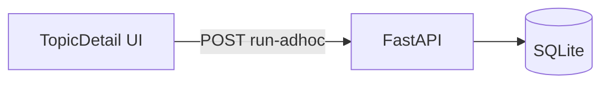
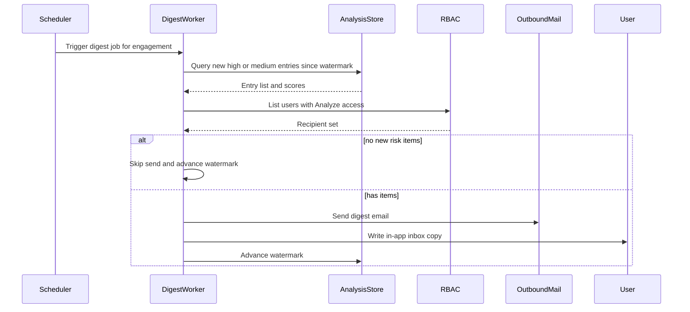
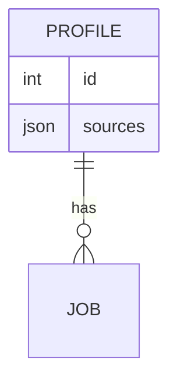

# Mermaid browser compatibility — seek-review

Disclosed from [`SKILL.md`](SKILL.md). Apply before embedding diagrams. Prefer also patching the source Markdown for pure syntax fixes. UI/zoom behavior: [html-contract.md](html-contract.md).

## High-frequency breaks

| Problem | Fix |
| --- | --- |
| Node ID has spaces/punctuation | camelCase/PascalCase id + quoted label: `TopicPage["Topic detail UI"]` |
| Label has `()`, `,`, or `:` | Quote the label |
| Bare ids `end` / `subgraph` / `class` | Rename (`endNode`, `classTable`) |
| Edge labels with special chars | Simplify or quote |
| Bad flowchart direction | `TB` / `LR` / `BT` / `RL` only |
| Nested quotes in labels | Outer doubles; rephrase if needed |
| `erDiagram` types with spaces | Underscores/camelCase types |
| HTML/Markdown inside fence | Strip |
| Very wide diagrams | Keep; overflow container |

## flowchart

Quoted labels when display text is not a plain id. Subgraphs: `subgraph id [Title]` (id without spaces).

Do **not** chain edges on one line (`A --> B --> C`); write one edge per line. Avoid `/`, `{`, `}`, and `→` inside node labels — rephrase (`scrape to filter`, not `scrape → filter`).

## sequenceDiagram

| Problem | Fix |
| --- | --- |
| `/`, `;`, `{`, `}`, or `,` in message text | Rephrase in plain words (`POST run-adhoc with url body`, not `POST { url }`) |
| Participant alias with spaces/hyphens that look like paths | CamelCase id + short alias (`RunAdhocAPI`, not `run-adhoc endpoint`) |
| `actor User` / participant id `User` | Prefer `actor ActorUser` or `participant Recipient as User` |
| Participant id is `end`/`alt`/`else`/`loop`/… | Rename id |
| Unbalanced `alt` / `else` / `end` | Match every `alt` with `end` |
| Empty message after `:` | Always include text |

## erDiagram

Entity names without spaces. Attributes: `type name` only.

## Sanity check

Confirm every diagram renders in the browser. On error, apply the tables above and re-test. Mirror safe syntactic fixes into the source `.md`.

## What not to do

- Do not replace Mermaid with PNG by default.
- Do not change meaning while “fixing” syntax.
- Do not ship a broken diagram with no error fallback.
